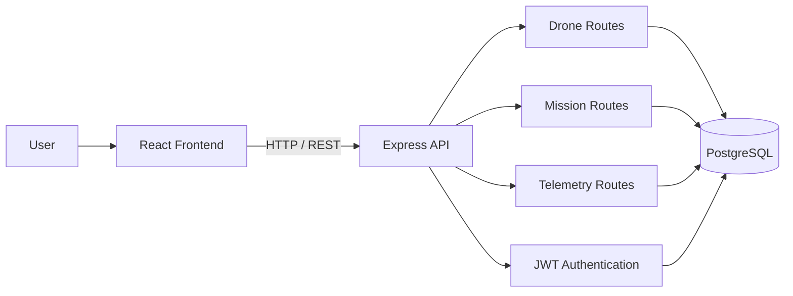

<div align="center">

# 🛰️ Fleet Command

**A full-stack drone fleet manager built with the PERN stack: PostgreSQL, Express, React and Node.**


</div>

Register drones, dispatch them on missions, and track their battery and position over time. Anyone can view the dashboard, while authenticated operators can manage the fleet.

## Why I built it

I already had a drone fleet backend built with Spring Boot in my Cloud Fleet project.

I wanted to rebuild the same domain using a JavaScript stack so I could compare how the same type of system feels in **Spring Boot versus Express**.

This version also gave me more practice building a complete application with both a backend and a frontend.

I intentionally used raw SQL instead of an ORM so I could keep the database interactions visible and understand what was happening underneath the application.

## What you can do

- 🔐 Register and log in as an operator using JWT authentication
- 🚁 Add, update and remove drones
- 📍 Dispatch drones to missions
- ✅ Complete or abort missions
- 🔋 Track drone battery levels
- 🧭 Track drone grid positions
- 📊 View telemetry history for each drone
- 🔄 Recall drones back to base

## How it fits together



## Tech stack

| Area | Technology |
|---|---|
| **Database** | PostgreSQL |
| **Backend** | Node.js, Express |
| **Authentication** | JWT, bcrypt |
| **Frontend** | React, Vite, React Router |
| **Styling** | Plain CSS |
| **Database access** | `pg` with raw SQL |
| **API style** | REST |

## Run it

### 1. Start PostgreSQL

Using Docker:

```bash
docker compose up -d
```

Or create a local PostgreSQL database called:

```text
fleet_command
```

### 2. Start the backend

```bash
cd backend
cp .env.example .env
npm install
npm run db:init
npm run dev
```

On Windows, if `cp` is unavailable:

```powershell
Copy-Item .env.example .env
```

The backend runs on:

```text
http://localhost:5000
```

### 3. Start the frontend

Open another terminal:

```bash
cd frontend
npm install
npm run dev
```

The frontend runs on:

```text
http://localhost:5173
```

The Vite development server proxies `/api` requests to the backend.

### 4. Optional sample data

```bash
psql -d fleet_command -f backend/src/db/seed.sql
```

## Project structure

```text
fleet-command/
├── backend/
│   └── src/
│       ├── config/        database connection
│       ├── db/            schema, seed data and init script
│       ├── middleware/    authentication, validation and error handling
│       ├── controllers/   request logic
│       └── routes/        REST endpoints
│
└── frontend/
    └── src/
        ├── api/           frontend API calls
        ├── context/       authentication context
        ├── components/    reusable UI components
        └── pages/         application pages
```

## API

All API routes begin with:

```text
/api
```

### Authentication

| Method | Route | Auth | Purpose |
|---|---|---|---|
| POST | `/auth/register` | No | Create an operator account |
| POST | `/auth/login` | No | Log in and receive a JWT |

### Drones

| Method | Route | Auth | Purpose |
|---|---|---|---|
| GET | `/drones` | No | List drones |
| GET | `/drones/:id` | No | View one drone |
| POST | `/drones` | Yes | Add a drone |
| PATCH | `/drones/:id` | Yes | Update a drone |
| DELETE | `/drones/:id` | Yes | Remove a drone |
| POST | `/drones/:id/recall` | Yes | Recall a drone back to base |

### Missions

| Method | Route | Auth | Purpose |
|---|---|---|---|
| GET | `/missions` | No | List missions |
| GET | `/missions/drone/:droneId` | No | View missions for one drone |
| POST | `/missions` | Yes | Dispatch a mission |
| PATCH | `/missions/:id/status` | Yes | Update mission status |

### Telemetry

| Method | Route | Auth | Purpose |
|---|---|---|---|
| GET | `/telemetry/drone/:droneId` | No | View telemetry history |
| POST | `/telemetry/drone/:droneId` | No | Log a telemetry reading |

Protected routes expect:

```text
Authorization: Bearer <token>
```

## Database design

The database contains four main tables:

### `operators`

Stores:

- id
- name
- email
- password hash
- creation timestamp

### `drones`

Stores:

- call sign
- model
- status
- battery percentage
- current grid position
- home base
- last-seen timestamp

### `missions`

Stores:

- assigned drone
- operator
- mission title
- destination
- mission status
- notes
- creation time
- completion time

### `telemetry_logs`

Stores historical:

- battery readings
- position readings
- timestamps

Mission and drone statuses use PostgreSQL `CHECK` constraints so the allowed values remain visible directly in the schema.

## Authentication flow

When an operator logs in:

```text
Login form
   ↓
Express API
   ↓
Verify email + password
   ↓
Generate JWT
   ↓
Return token
   ↓
React stores authentication state
   ↓
Protected requests include Authorization header
```

Passwords are hashed using `bcrypt` before being stored in PostgreSQL.

## What I learned rebuilding the fleet idea

Building the same domain in two different stacks made the differences much easier to understand.

### Spring Boot

Spring Boot gives a lot of structure out of the box.

Things like dependency injection, application configuration and data access follow established patterns, which makes a larger backend feel organised quickly.

### Express

Express gives me much more direct control over how the application is structured.

That also means I have to make more decisions myself about middleware, validation, routing and error handling.

### Raw SQL

Using `pg` without an ORM forced me to work directly with SQL queries, joins and constraints instead of relying on an abstraction layer.

Rebuilding the same domain helped me understand that the technology changes, but the underlying engineering problems stay similar: authentication, validation, state changes, persistence and API design.

## Known limitation

The telemetry write endpoint currently does not require authentication:

```text
POST /telemetry/drone/:droneId
```

That means a client can currently submit a telemetry reading without being an authenticated operator.

This is one of the first security improvements I plan to make.

## What's next

- [ ] Protect the telemetry write endpoint
- [ ] Add backend tests with Jest and Supertest
- [ ] Add input-validation tests
- [ ] Add Helmet
- [ ] Add rate limiting
- [ ] Add GitHub Actions for backend tests
- [ ] Add WebSockets for live telemetry
- [ ] Add operator and admin roles
- [ ] Add pagination to missions and telemetry
- [ ] Add a live map view
- [ ] Deploy the frontend and backend

## License

MIT

---

<p align="center">Built by <a href="https://github.com/ZinhleHlongwane">Zinhle Hlongwane</a> · Johannesburg 🇿🇦 · <a href="https://www.linkedin.com/in/zinhle-hlongwane-872354209">LinkedIn</a></p>
